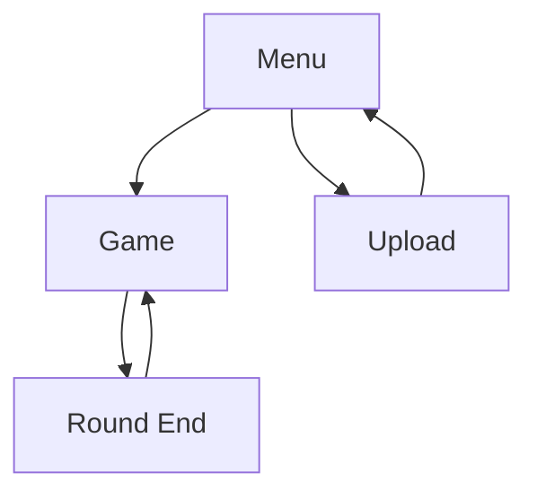

# Technical Details

## Game Components

### Movie Database Management
```javascript
const movieDb = {
    movies: [],          // Stores fetched movie data
    currentMovie: null,  // Currently displayed movie
    usedMovies: Set(),   // Tracks shown movies
    
    // Core functions
    fetchPopularMovies()  // Fetches movies from TMDb
    getRandomMovie()      // Selects random unused movie
    getCurrentMovie()     // Returns current movie
    setCurrentMovie()     // Updates current movie
}
```

### Timer System
```javascript
const TIME_LIMIT = 15;  // Round duration in seconds
let timeLeft = TIME_LIMIT;
let currentTimerInterval = null;

// Core functions
function updateTimer()    // Updates timer UI
function stopTimer()      // Clears timer interval
function startTimer()     // Starts countdown
```

### Animation System
```javascript
function animateTransition(callback, duration) {
    // Uses requestAnimationFrame for smooth transitions
    // Handles round transitions and UI updates
}
```

## Data Structures

### Movie Object
```javascript
{
    id: number,           // TMDb movie ID
    title: string,        // Movie title
    backdrop_path: string // Image path
    // Additional TMDb data
}
```

### User Object
```javascript
{
    username: string,
    department: string,
    // Additional user data
}
```

## State Management

### Game States
1. Menu State
   - Shows play/upload options
   - Manages navigation

2. Game State
   - Tracks current movie
   - Manages timer
   - Handles user input

3. Upload State
   - Manages image uploads
   - Handles movie selection

### State Transitions


## Security Implementation

### Content Security Policy
```html
<meta http-equiv="Content-Security-Policy" 
      content="default-src 'self';
               img-src 'self' https://image.tmdb.org data:;
               script-src 'self';
               style-src 'self' 'unsafe-inline';
               connect-src 'self' https://api.themoviedb.org;">
```

### API Security
- Server-side validation
- Rate limiting (TODO)
- Input sanitization
- Error handling

## Performance Optimizations

### Image Loading
- Preloading next image
- Fallback for failed loads
- Loading state management

### Timer Performance
- RequestAnimationFrame for animations
- Interval-based updates
- Clear cleanup on state changes

## Testing Procedures

### API Testing
```bash
# Test endpoints
curl -v http://localhost:8888
curl -v http://localhost:8888/api/check-login

# Test game flow
curl -X POST http://localhost:8888/api/login -H "Content-Type: application/json" -d '{"username":"testuser1"}'
```

### Browser Testing
1. Check CSP compliance
2. Verify timer accuracy
3. Test image loading
4. Validate game flow
